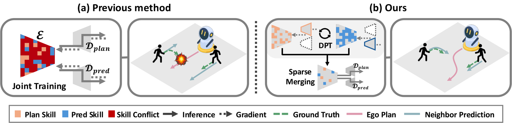
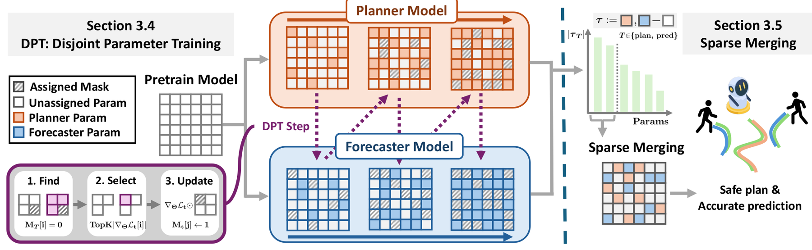

<div align="center">

# Unified Prediction and Planning via Conflict-Aware Disjoint Parameter Training

Taewon Seo<sup>1*</sup>, Seonae Jeon<sup>1*</sup>, Giwon Lee<sup>2*</sup>,
Kuk-Jin Yoon<sup>2&dagger;</sup>, Daehee Park<sup>1&dagger;</sup>

<sup>1</sup>DGIST &nbsp;&nbsp; <sup>2</sup>KAIST  
ECCV 2026

[[Project Page](https://dpt2026.github.io/)]
[[arXiv](https://arxiv.org/abs/2607.19971)]



</div>

## Overview

Compact unified models for motion prediction and planning can suffer from
**Skill Conflict**, where both tasks compete for overlapping parameters in a
shared encoder. **Disjoint Parameter Training (DPT)** progressively assigns
non-overlapping, task-critical parameters to planning and prediction, then
updates each task only within its assigned region. **Sparse Merging** combines
the most influential planner and forecaster task-vector coordinates to retain
both skills in one model.

```text
Pretrained Model -> DPT Planner / DPT Forecaster -> Sparse Merged Model
```

## Method

<div align="center">



</div>

`dpt/training.py` implements the DPT stage in Fig. 4: for each task, it finds
task gradients, selects high-gradient parameters that have not been assigned to
the other task, and updates only the task-owned region. `dpt/merging.py`
implements the second stage by retaining the most influential coordinates from
the planner and forecaster task vectors and merging them into the pretrained
model.

## Setup

```bash
conda env create -f environment.yml
conda activate social
bash scripts/download_checkpoints.sh
bash scripts/check_portable.sh
```

The processed JRDB trajectory and 2D-box data used by this release are under
`data/jrdb_2dbox/`. See [DATA.md](DATA.md) for the dataset source and license.

## Quick Start

Evaluate the released DPT planner, forecaster, and sparse merged model:

```bash
bash scripts/evaluate_jrdb_dpt.sh
```

Train task-specialized planner and forecaster models with DPT:

```bash
bash scripts/run_jrdb_dpt_finetune.sh
```

Merge the DPT models using the paper setting of `K=1%`:

```bash
bash scripts/run_jrdb_dpt_sparse_merge_k1.sh
```

The scripts use the default visible CUDA device. Set `CUDA_VISIBLE_DEVICES`
before a command when a particular GPU is required.

## Representative Results

Results for the released `K=1%` sparse merged checkpoint on the JRDB test split:

| Model | Planning ADE &darr; | Collision Rate &darr; | Planning FDE &darr; | Miss Rate &darr; | Prediction ADE &darr; | Prediction FDE &darr; |
|---|---:|---:|---:|---:|---:|---:|
| DPT + Sparse Merging (`K=1%`) | 0.4044 | 0.0091 | 0.7458 | 0.3706 | 0.5952 | 1.0352 |

## Released Checkpoints

| Checkpoint | Role |
|---|---|
| `pretrained_model.pth.tar` | Shared pretrained initialization |
| `dpt_plan_model.pth.tar` | Planner specialized with DPT |
| `dpt_pred_model.pth.tar` | Forecaster specialized with DPT |
| `dpt_sparse_merged_model_k1.pt` | DPT models merged at `K=1%` |
| `plan_finetuned_model.pth.tar` | Standard planner fine-tuning reference |
| `pred_finetuned_model.pth.tar` | Standard forecaster fine-tuning reference |

Checkpoint files are distributed through
[GitHub Releases](https://github.com/taewon-seo/disjoint-parameter-training/releases/latest).
Download them with:

```bash
bash scripts/download_checkpoints.sh
```

The files are placed in `checkpoints/` and include the model configuration used
to construct and evaluate each model.

## Code Structure

The `dpt` package contains the method and the components it operates on:

```text
dpt/
├── training.py    # disjoint allocation and masked task training
├── merging.py     # sparse task-vector merging
├── backbone.py    # unified prediction-planning backbone
├── jrdb.py        # JRDB reader, preprocessing, and dataloaders
├── objectives.py  # planning and prediction losses
└── runtime.py     # configuration, logging, and checkpoints
```

The root-level `train_dpt.py`, `sparse_merging.py`, and `evaluate_jrdb.py`
provide the command-line entry points. `train_backbone.py` handles backbone
pretraining and standard task fine-tuning.

## Citation

```bibtex
@inproceedings{seo2026dpt,
  title     = {Unified Prediction and Planning via Conflict-Aware Disjoint Parameter Training},
  author    = {Seo, Taewon and Jeon, Seonae and Lee, Giwon and Yoon, Kuk-Jin and Park, Daehee},
  booktitle = {European Conference on Computer Vision (ECCV)},
  year      = {2026}
}
```

## Acknowledgement

The unified backbone is based on
[Social-Transmotion](https://github.com/vita-epfl/social-transmotion).

Research supported by the
[NVIDIA Academic Grant Program](https://www.nvidia.com/en-us/industries/higher-education-research/academic-grant-program/).

## License

The source code is released under the
[GNU Affero General Public License v3.0](LICENSE). Portions of this repository
are adapted from Social-Transmotion, which is distributed under the same
license. The included JRDB-derived data is governed separately as described in
[DATA.md](DATA.md).
